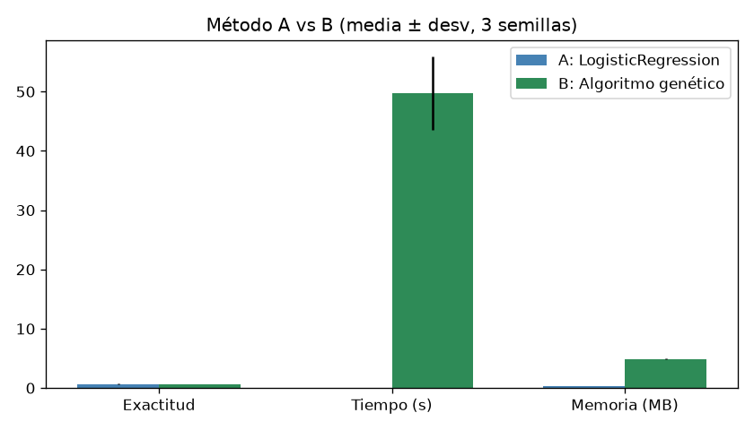

# Algoritmo genético vs. regresión logística en datos genómicos

Computación Bioinspirada (UNIMINUTO, NRC-93521), semana 5. ¿Un algoritmo evolutivo selecciona mejor los marcadores genéticos que un método estadístico clásico, y a qué costo?

## Experimento
- Datos sintéticos: 500 muestras × 1000 SNPs (valores 0/1/2), solo 20 determinan la etiqueta, 10 % de ruido en las etiquetas, partición 70/30.
- A: regresión logística con los 1000 SNPs.
- B: algoritmo genético que selecciona SNPs. Individuo = máscara de 1000 bits; población 20, 15 generaciones, torneo, cruce de un punto, mutación 1 % por bit, elitismo 2. Aptitud = exactitud con validación cruzada de 3 pliegues, menos 0,0005 por SNP activo.
- Métricas: exactitud y F1 en prueba, tiempo (perf_counter), memoria pico (tracemalloc). Semillas 42, 7 y 123.

## Resultados (media de 3 semillas)

| Método | Exactitud | F1 | Tiempo (s) | Memoria (MB) | SNPs | Relevantes hallados |
|---|---|---|---|---|---|---|
| Regresión logística | 0,691 | 0,451 | 0,034 | 0,37 | 1000 | — |
| Algoritmo genético | 0,664 | 0,453 | 49,7 | 4,89 | 493 | 10,7 de 20 |

## Lectura
- El genético fue más de mil veces más lento y usó unas 13 veces más memoria, sin ganar precisión.
- Se quedó con 493 de 1000 SNPs y encontró 10,7 de los 20 relevantes: lo mismo que elegir al azar. Con 15 generaciones no alcanzó a separar la señal del ruido.
- Un F1 cercano a 0,45 muestra que ambos fallan con los casos positivos, algo que la exactitud sola esconde.

## Reproducir
python3 experimento.py   (requiere numpy, scikit-learn y matplotlib; unos 50 s por semilla)
